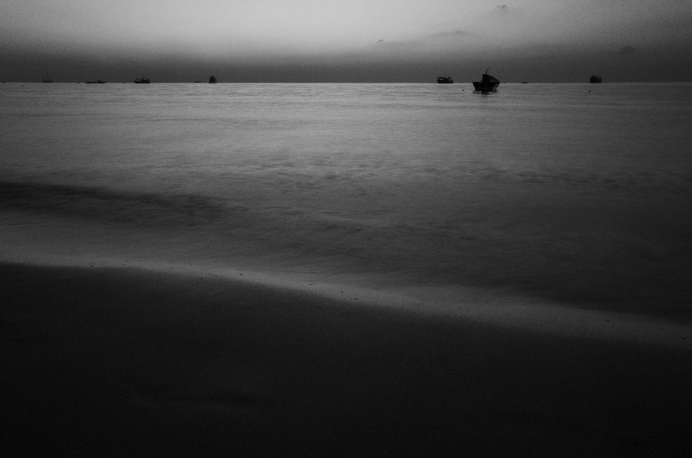

Hey there, Just to give you a heads-up, this is a demo. Since the domain and server are overseas, there might be a bit of lag – hope you understand. You know, back in the mainland, there's all that content checking and registration, which just doesn't sit right with my personal values. So, I'll probably look into other ways to speed things up down the line.

By the way, I had this idea to make the links green at first. But, you know, keeping things sleek and minimalistic, I decided to skip that. Feels just about right now, doesn't it?

Oh, and if English isn't your jam, just pop on your browser's translation*（浏览器翻译功能）*. It should do the trick..

***F16/S1.3/ISO100-Ricoh GR II  
Shot in Koh Tao, Thailand in 2017***